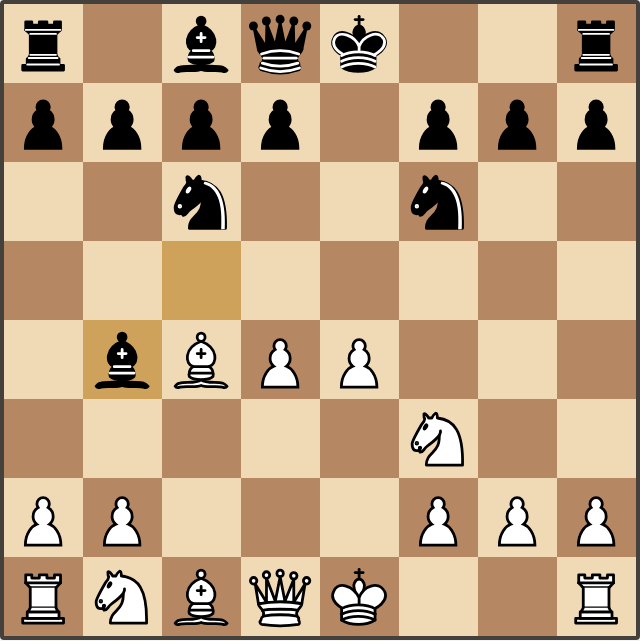
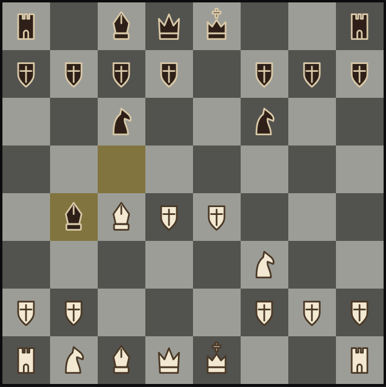
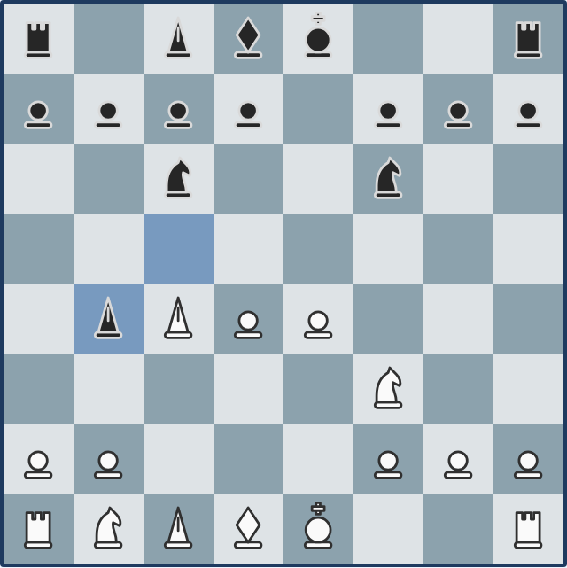

# Gambit ♞

Chess in the browser: play against Stockfish or a friend on the same device. Pure static frontend — no backend, no build step, no tracking.

**▶ Play now: https://danielededo.github.io/gambit/**


## Features

- **Two modes** — Human vs AI (you play White) or Human vs Human on the same device
- **Difficulty 1-8** — Stockfish 18 running locally in your browser, from beginner to full strength
- **Full rules** — castling, en passant, promotion (with piece picker), check/checkmate/stalemate/draws, powered by [chess.js](https://github.com/jhlywa/chess.js)
- **Helpful board** — legal-move highlighting, last-move marker, move history in algebraic notation
- **Your look** — 4 themes × 4 piece sets, remembered across visits

| Light · Standard | Dark · Medieval | Blue · Minimal | Sepia · Unicode |
|:---:|:---:|:---:|:---:|
|  |  |  |  |

## How to play

Click a piece, then one of its highlighted destinations. Pick mode, difficulty, theme, and pieces from the header — **New game** restarts anytime.

## Run locally

```bash
python -m http.server   # or: npx serve
```

Open http://localhost:8000. No install, no build — but an HTTP server is required (ES modules and the Stockfish worker don't run from `file://`).

## Deployment

GitHub Pages (Settings → Pages → Source: *GitHub Actions*): every push to `main` publishes the repository root via [`deploy.yml`](.github/workflows/deploy.yml).

## Roadmap

Multiplayer with PIN · replay & PGN import · engine analysis · timers · ELO · animations & sounds · play as Black.

## Contributing & license

See [CONTRIBUTING.md](CONTRIBUTING.md) — adding a theme or a piece set is a one-file job.

Project code is [MIT](LICENSE). Vendored components keep their own licenses: chess.js (BSD-2-Clause), [Stockfish.js](https://github.com/nmrugg/stockfish.js) (GPLv3), standard piece SVGs by [Cburnett et al.](https://commons.wikimedia.org/wiki/Category:SVG_chess_pieces/Standard) (CC BY-SA 3.0); medieval and minimal sets are original MIT artwork.
