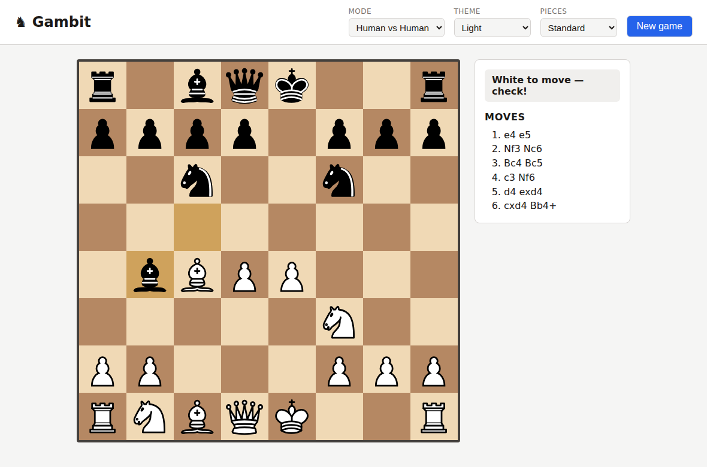
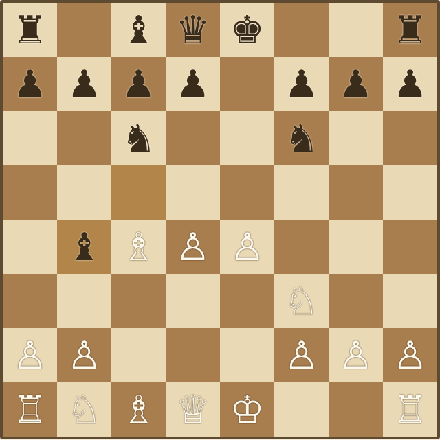
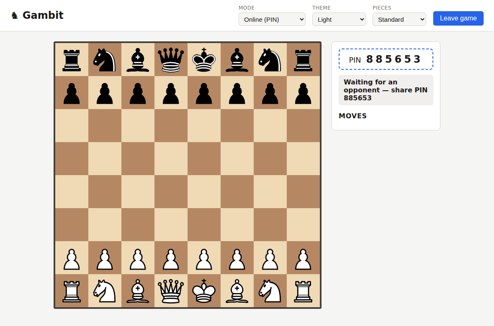

# Gambit ♞

Chess in the browser: play against Stockfish, a friend on the same device, or **online with a 6-digit PIN** — no accounts, no tracking.



## Features

- **Three modes** — Human vs AI, Human vs Human (same device), Online via PIN
- **Difficulty 1-8** — Stockfish 18 running locally in your browser, from beginner to full strength
- **Full rules** — castling, en passant, promotion (with piece picker), check/checkmate/stalemate/draws, powered by [chess.js](https://github.com/jhlywa/chess.js)
- **Fair online play** — the server validates every move; reconnect and resume after a page reload
- **Helpful board** — legal-move highlighting, last-move marker, move history in algebraic notation
- **Your look** — 4 themes × 4 piece sets, remembered across visits

| Light · Standard | Dark · Medieval | Blue · Minimal | Sepia · Unicode |
|:---:|:---:|:---:|:---:|
|  |  |  |  |

## How to play

Click a piece, then one of its highlighted destinations. Pick mode, difficulty, theme, and pieces from the header — **New game** restarts anytime.

**Online:** choose *Online (PIN)*, press *Create game*, and share the 6-digit PIN; your friend joins with it and plays Black (board flipped on their side). Closing the tab by accident? Reload and the game resumes. The server hosts a limited number of parallel games.



## Run locally

```bash
npm install && npm start   # full app (local + online play) on http://localhost:8080
```

Static-only alternative (local modes, no online): `python -m http.server -d client` — an HTTP server is required either way, ES modules and the Stockfish worker don't run from `file://`.

## Architecture & deployment

- `client/` — static frontend (vanilla JS, no build step). Runs anywhere; Stockfish plays in the visitor's browser.
- `server/` — Node.js WebSocket server for online games: it serves `client/` and is the authority on the rules (every move re-validated server-side). In-memory for now, `MAX_ACTIVE_GAMES` caps parallel games (default 20).

Full deployment needs a Node host (`npm start`, honors `PORT`). The GitHub Pages workflow ([`deploy.yml`](.github/workflows/deploy.yml)) publishes the static client only — local modes work there, online play does not.

### Server configuration

All optional, set via environment variables:

| Variable | Default | Purpose |
|---|---|---|
| `PORT` | `8080` | HTTP/WebSocket port |
| `MAX_ACTIVE_GAMES` | `20` | Global cap on concurrent online games |
| `MAX_GAMES_PER_IP` | `3` | Live games one client (IP) may own — stops one person exhausting the global cap |
| `MAX_CONNECTIONS_PER_IP` | `20` | Concurrent WebSocket connections per IP |
| `JOIN_FAILURE_LIMIT` | `10` | Failed PIN joins per IP per minute before a short lockout (anti brute-force) |
| `ALLOWED_ORIGINS` | same-origin | Comma-separated origins allowed to open control sockets |
| `TRUST_PROXY` | `0` | Set to `1` when behind a proxy/load balancer so the client IP is read from `X-Forwarded-For` |

> **Behind a proxy (Render, Fly, Railway, …): set `TRUST_PROXY=1`.** Otherwise every request appears to come from the proxy's IP and the per-IP limits apply to all players at once.

## Roadmap

Persistence for online games (SQLite) · accounts & ELO · replay & PGN import · engine analysis · timers · animations & sounds · play as Black vs AI.

## Contributing & license

See [CONTRIBUTING.md](CONTRIBUTING.md) — adding a theme or a piece set is a one-file job.

Project code is [MIT](LICENSE). Vendored components keep their own licenses: chess.js (BSD-2-Clause), [Stockfish.js](https://github.com/nmrugg/stockfish.js) (GPLv3), standard piece SVGs by [Cburnett et al.](https://commons.wikimedia.org/wiki/Category:SVG_chess_pieces/Standard) (CC BY-SA 3.0); medieval and minimal sets are original MIT artwork.
