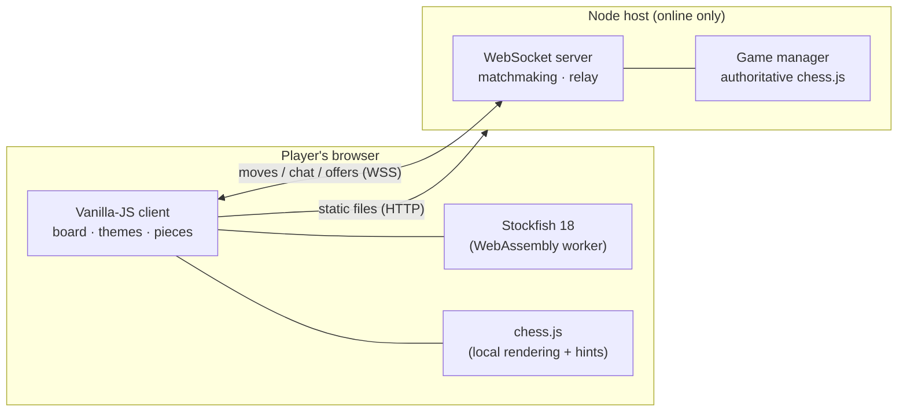

<div align="center">

# Gambit ♞

**Play chess in your browser — against Stockfish, a friend on the same device, or online with just a 6-digit PIN.**
No accounts, no tracking, no build step. Vanilla JavaScript front to back.

[](https://github.com/Danielededo/gambit/actions/workflows/ci.yml)
[](https://gambit-gky7.onrender.com)
[](LICENSE)
[](package.json)
[-brightgreen.svg)](package.json)
[](#run-locally)

### [▶ Play online](https://gambit-gky7.onrender.com) &nbsp;·&nbsp; [Single-player on GitHub Pages](https://danielededo.github.io/gambit/)


</div>

Gambit is a complete, dependency-light chess app: a **vanilla-JS client** (no framework, no bundler) and a **~350-line Node WebSocket server** that is the sole authority on the rules. The AI runs entirely in the visitor's browser via WebAssembly, so the server only ever brokers online games — and the same client ships as two releases: a static single-player build on GitHub Pages and the full online app on any Node host.

## Features

- **Three ways to play** — Human vs AI, Human vs Human on one device, or Online via a shared 6-digit PIN (with a one-tap invite link).
- **Real chess** — castling, en passant, promotion (with a piece picker), check / checkmate / stalemate / all draw types, via [chess.js](https://github.com/jhlywa/chess.js).
- **Stockfish 18**, 8 difficulty levels, running locally in WebAssembly — the AI costs the server nothing.
- **Fair, server-authoritative online play** — every move is re-validated on the server; reconnect and resume after a reload or dropped connection.
- **Play together** — in-game chat (sound + tab-title unread badge), draw offers, and one-click rematch with colors swapped.
- **Polished board** — legal-move dots, last-move and in-check highlighting, center-board toasts for check / mate / game events, captured-pieces tray with material score, synthesized move sounds (mutable).
- **Make it yours** — 4 themes × 4 piece sets, remembered across visits.

| Light · Standard | Dark · Medieval | Blue · Minimal | Sepia · Unicode |
|:---:|:---:|:---:|:---:|
|  |  |  |  |

## How to play

Click a piece, then one of its highlighted destinations. Pick mode, difficulty, theme, and pieces from the header; **New game** restarts anytime.

**Online:** choose *Online (PIN)* → *Create game*, then share the PIN or tap the invite link. Your friend joins and plays Black (their board flips automatically). Accidentally closed the tab? Reload and the game resumes.


## Architecture



- **`client/`** — static frontend, plain ES modules, no build step. Local modes (AI, hot-seat) work fully offline in the browser; Stockfish and chess.js are vendored.
- **`server/`** — Node.js (≥20, ESM), one runtime dependency (`ws`). Serves the client and hosts online games, re-validating **every** move with chess.js — the client is never trusted. Games are in memory; `MAX_ACTIVE_GAMES` caps parallel games and per-IP limits curb abuse.

The client probes `/healthz` on load and hides Online mode when no server is present, so a static-only deploy (GitHub Pages) degrades gracefully to single-player.

## Run locally

```bash
npm install && npm start   # full app (local + online) at http://localhost:8080
npm test                   # protocol, security, social & sound suites
```

Front-end only (no online): `python -m http.server -d client`. An HTTP origin is required either way — ES modules and the Stockfish worker don't run from `file://`.

## Deployment

The client is deployed to **GitHub Pages** (static, single-player) by [`deploy.yml`](.github/workflows/deploy.yml). The full app runs on any Node host; a one-click **Render** blueprint is included:

1. In [Render](https://render.com) → **New + → Blueprint** → pick this repo. It reads [`render.yaml`](render.yaml): build `npm install`, start `npm start`, health-check `/healthz`, `TRUST_PROXY=1` preset.
2. Served at `https://<name>.onrender.com` over `wss://` automatically.

> **Free-plan trade-off:** the service sleeps after ~15 min idle (first visit then wakes in ~30s) and in-memory games are lost on restart. Persistence is on the roadmap.

Every push to `main` redeploys via [`deploy-render.yml`](.github/workflows/deploy-render.yml) — set the repo secret `RENDER_DEPLOY_HOOK` to the service's Deploy Hook URL. Behind any proxy, set `TRUST_PROXY=1` so per-IP limits use the real client IP.

<details>
<summary><b>Server configuration</b> (environment variables, all optional)</summary>

| Variable | Default | Purpose |
|---|---|---|
| `PORT` | `8080` | HTTP/WebSocket port |
| `MAX_ACTIVE_GAMES` | `20` | Global cap on concurrent online games |
| `MAX_GAMES_PER_IP` | `3` | Live games one client (IP) may own |
| `MAX_CONNECTIONS_PER_IP` | `20` | Concurrent WebSocket connections per IP |
| `JOIN_FAILURE_LIMIT` | `10` | Failed PIN joins per IP per minute before a short lockout |
| `ALLOWED_ORIGINS` | same-origin | Comma-separated origins allowed to open control sockets |
| `HEARTBEAT_MS` | `30000` | WebSocket ping interval (proxy keep-alive + dead-socket detection) |
| `TRUST_PROXY` | `0` | Read the client IP from `X-Forwarded-For` (set to `1` behind a proxy) |

See [`.env.example`](.env.example). The server shuts down cleanly on `SIGTERM`/`SIGINT`.

</details>

## Project structure

```
client/            static frontend (deployable on its own)
  index.html
  js/              game.js · board.js · ai.js · online.js · theme.js · pieces.js · sound.js · main.js
  js/vendor/       chess.js, Stockfish (with licenses)
  styles/          main.css + themes/
  assets/          piece sprites, screenshots
server/            server.js (transport + static) · game-manager.js (authoritative state)
test/              protocol · security · social · sound suites (no framework)
```

## Roadmap

Online-game persistence (SQLite/Turso) · accounts & ELO · move replay & PGN import · engine analysis · clocks / blitz · play as Black vs the AI.

## Contributing

See [CONTRIBUTING.md](CONTRIBUTING.md) — adding a theme or a piece set is a one-file change, and `npm test` runs the full server suite locally.

## License & credits

Project code is [MIT](LICENSE). Vendored components keep their own licenses: [chess.js](https://github.com/jhlywa/chess.js) (BSD-2-Clause), [Stockfish.js](https://github.com/nmrugg/stockfish.js) (GPLv3), and the standard piece set by [Cburnett et al.](https://commons.wikimedia.org/wiki/Category:SVG_chess_pieces/Standard) (CC BY-SA 3.0, via [cm-chessboard](https://github.com/shaack/cm-chessboard)). The medieval and minimal piece sets are original artwork for this project (MIT).
